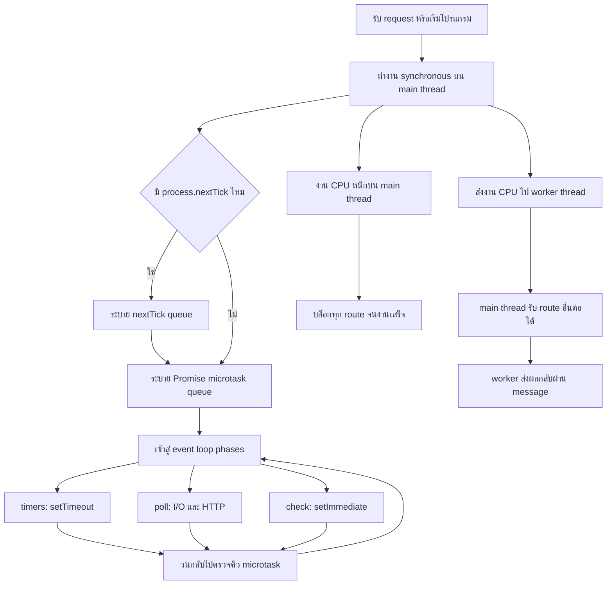

# LeanNode30Days

บันทึกการเรียน Node.js แบบลงมือทำต่อเนื่อง 30 วัน โดยเป้าหมายคือเปลี่ยนจากโจทย์ JavaScript ขนาดเล็กให้กลายเป็นโปรเจกต์ backend ที่อธิบายได้ ทดสอบได้ และนำไปใส่ใน portfolio หรือ CV ได้จริง

## เป้าหมายการเรียน 30 วัน

- เข้าใจ JavaScript ที่จำเป็นต่อการทำงานฝั่ง server: function, array methods, error handling และ asynchronous programming
- สร้าง HTTP server ด้วย Node.js core และเข้าใจ request, response, status code และ JSON
- ใช้ Express เพื่อจัดการ routing, middleware, validation และ error handling อย่างเป็นระบบ
- เรียนรู้การออกแบบ REST API, การเก็บข้อมูล, authentication, testing และการ deploy
- ส่งมอบโปรเจกต์หลักหนึ่งชิ้นที่มี README, API documentation, automated tests และประวัติ commit ที่สื่อสารพัฒนาการได้

## เส้นทาง 30 วัน

| ช่วง | วัน | หัวข้อ | ผลลัพธ์ที่ต้องส่งมอบ |
| --- | --- | --- | --- |
| พื้นฐาน JavaScript | 1-5 | function, array methods, object, module และการจัดการ error | utility functions พร้อมตัวอย่าง input/output |
| Asynchronous Node.js | 6-9 | callback, Promise, async/await และการอ่าน configuration จาก environment | service จำลองที่โหลดข้อมูลและจัดการ failure ได้ |
| HTTP และ Express | 10-14 | `node:http`, Express, routing, middleware และ status code | Candidate API เวอร์ชันแรก |
| ออกแบบ Task Hub | 15-18 | REST conventions, resource modeling, validation และ pagination | API contract และโครงสร้างโปรเจกต์ที่ชัดเจน |
| Data และความปลอดภัย | 19-23 | database, migrations, authentication, authorization และ input sanitization | Task Hub API ที่เก็บข้อมูลจริงและป้องกัน route สำคัญ |
| คุณภาพและการส่งมอบ | 24-27 | unit/integration tests, logging, error response และ API documentation | test suite, health check และ OpenAPI หรือเอกสาร endpoint |
| Portfolio readiness | 28-30 | refactor, deploy, README, demo และทบทวนบทเรียน | โปรเจกต์พร้อมสาธิตและ bullet สำหรับ CV |

## โปรเจกต์หลัก: Task Hub API

### เป้าหมาย

สร้าง REST API สำหรับจัดการงานส่วนตัวหรือทีมขนาดเล็ก ผู้ใช้สามารถสร้างงาน กำหนดสถานะและความสำคัญ มอบหมายงาน เพิ่มกำหนดส่ง และกรองงานเพื่อเห็นสิ่งที่ต้องทำต่อไปได้อย่างรวดเร็ว

### ขอบเขตเวอร์ชันแรก

- ผู้ใช้สมัครและเข้าสู่ระบบด้วย email/password
- ผู้ใช้จัดการ task ของตนเอง และเข้าถึงเฉพาะข้อมูลที่มีสิทธิ์
- task มี title, description, status, priority, due date, assignee และ timestamps
- รองรับการค้นหา กรองตามสถานะ/ความสำคัญ และแบ่งหน้า
- มี validation ที่ขอบเขต API และ response error format เดียวกัน
- มี health check, logging และ test สำหรับ business rules กับ endpoint สำคัญ

### สถานะของ task

`todo` -> `in_progress` -> `done`

อนุญาตให้ย้อนกลับจาก `in_progress` ไป `todo` ได้ และอนุญาตให้ย้ายจาก `done` กลับมา `in_progress` เมื่อมีการแก้ไขงาน

### API ที่วางไว้

| Method | Endpoint | หน้าที่ | Auth |
| --- | --- | --- | --- |
| `GET` | `/health` | ตรวจสอบว่า service ทำงานอยู่ | ไม่ต้องใช้ |
| `POST` | `/auth/register` | สร้างผู้ใช้ใหม่ | ไม่ต้องใช้ |
| `POST` | `/auth/login` | เข้าสู่ระบบและรับ token | ไม่ต้องใช้ |
| `GET` | `/tasks` | ดูรายการ task พร้อม filter และ pagination | ต้องใช้ |
| `POST` | `/tasks` | สร้าง task | ต้องใช้ |
| `GET` | `/tasks/:id` | ดูรายละเอียด task | ต้องใช้ |
| `PATCH` | `/tasks/:id` | แก้ไข task หรือเปลี่ยนสถานะ | ต้องใช้ |
| `DELETE` | `/tasks/:id` | ลบ task | ต้องใช้ |

ตัวอย่าง query สำหรับรายการ task:

```text
GET /tasks?status=in_progress&priority=high&page=1&limit=20
```

ตัวอย่าง response ที่ควรรักษาให้สม่ำเสมอ:

```json
{
	"data": [],
	"meta": {
		"page": 1,
		"limit": 20,
		"total": 0
	}
}
```

### แนวทางเทคนิค

- Node.js และ Express เป็น runtime/framework หลัก
- แยก route, controller, service, repository และ validation ออกจากกันเมื่อโค้ดเริ่มโต
- ใช้ environment variables สำหรับ port, database URL และ secret; ห้าม commit secret ลง repository
- ใช้ relational database พร้อม migration เพื่อให้ schema reproducible
- ใช้ token-based authentication และ hash password ด้วย library ที่เหมาะสม
- เพิ่ม unit tests สำหรับ service และ integration tests สำหรับ API ที่สำคัญ
- ส่ง error ในรูปแบบเดียวกัน เช่น `{ "error": { "code": "VALIDATION_ERROR", "message": "..." } }`

### Definition of Done

- ผู้ใช้ที่ไม่มีสิทธิ์ไม่สามารถอ่านหรือแก้ไข task ของผู้อื่นได้
- validation ปฏิเสธข้อมูลไม่ครบหรือสถานะที่ไม่ถูกต้องด้วย status code ที่เหมาะสม
- happy path และ failure path ของ endpoint หลักมี automated tests
- มีคำสั่งติดตั้ง รัน test และ start service ที่ทำตามได้จาก README
- มีตัวอย่าง request/response และ deployment URL หรือวิธีรันในเครื่อง

## สิ่งที่ทำไว้แล้ว

- `app.js` และ `app2.js`: ฝึก filter, reduce, summary และ edge case ของข้อมูลว่าง
- `app3.js`: ฝึก Promise, `async/await` และ error handling
- `app4.js`: สร้าง HTTP API ด้วย Node.js core
- `app5.js`: ย้ายมาใช้ Express, JSON middleware และ API key middleware
- `app6.js`: อ่าน command-line argument และข้อมูล runtime ของ Node.js
- `appDay4.js`: ฝึกแปลง callback เป็น Promise, ใช้ `util.promisify`, เรียก API พร้อมกัน, retry และ timeout
- `appDay5.js`: ทดลองลำดับ event loop, เปรียบเทียบ HTTP route ที่บล็อก main thread กับ `worker_threads`
- `appDay6.js`: สร้าง CLI จดบันทึก, สแกนโฟลเดอร์, จัดไฟล์ตามนามสกุล และดูการเปลี่ยนแปลงด้วย `fs.watch`

## Day 6: File system และ path แบบข้ามระบบปฏิบัติการ

วันนี้ฝึกอ่านและเขียนไฟล์แบบ asynchronous ด้วย `fs/promises` และ `async/await` เพื่อไม่บล็อก server หรือโปรแกรมหลัก ใช้ `path.resolve()` และ `path.join()` แทนการต่อ string เอง ทำให้ path ใช้งานได้ทั้ง Linux และ Windows

### CLI จดบันทึก

คำสั่งทั้งหมดรันจากโฟลเดอร์ `LeanNode30Days` และเก็บข้อมูลไว้ใน `notes.json`:

```bash
node appDay6.js add "อ่านเรื่อง fs/promises"
node appDay6.js list
node appDay6.js search fs
node appDay6.js remove <id>
```

ถ้าไม่มี `notes.json` โปรแกรมจะตรวจ error code `ENOENT` แล้วเริ่มด้วยรายการว่างแทนที่จะหยุดทำงาน

### สแกนไฟล์แบบ recursive

คำสั่งนี้แสดง path และขนาดของไฟล์ทั้งหมด รวมไฟล์ในโฟลเดอร์ย่อย:

```bash
node appDay6.js scan ./โฟลเดอร์ที่ต้องการดู
```

ใช้ `readdir(folder, { recursive: true, withFileTypes: true })` และ `stat()` เพื่ออ่านขนาดไฟล์ โดยไม่ใช้ฟังก์ชัน Sync

### จัดไฟล์ Downloads แบบปลอดภัย

ควรสร้างโฟลเดอร์จำลองก่อน เช่น `downloads-demo` แล้วทดลอง preview:

```bash
node appDay6.js organize ./downloads-demo
```

โปรแกรมจะแสดงแผนการย้ายไฟล์ตามนามสกุล แต่ยังไม่แก้ไฟล์จริง ต้องเพิ่ม `--apply` เมื่อตรวจสอบแล้ว:

```bash
node appDay6.js organize ./downloads-demo --apply
```

เช่น `photo.jpg` จะไปอยู่ใน `jpg/` และ `readme.txt` จะไปอยู่ใน `txt/` ไฟล์ที่ไม่มีนามสกุลจะไปอยู่ใน `no-extension/`

### ดูการเปลี่ยนแปลงของไฟล์

```bash
node appDay6.js watch ./downloads-demo
```

คำสั่งนี้ใช้ `fs.watch()` และจะแสดง event เมื่อมีการสร้าง แก้ไข หรือลบไฟล์ กด `Ctrl+C` เพื่อหยุด

### ความรู้เรื่อง ESM

ไฟล์ `appDay6.js` ใช้ CommonJS เพื่อให้เข้ากับไฟล์การบ้านเดิมของ repository จึงใช้ `__dirname` ได้โดยตรง ถ้าเขียนเป็น ESM บน Node.js 20.11+ สามารถใช้ `import.meta.dirname` หรือแปลงจาก `import.meta.url` แล้วค่อยส่ง path เข้า `path.join()` ได้ ห้ามต่อ path ด้วยเครื่องหมาย `/` หรือ `\\` เอง เพราะแต่ละระบบปฏิบัติการใช้ตัวคั่นไม่เหมือนกัน

## Day 5: Event loop และ worker threads

รันตัวอย่างด้วยคำสั่ง:

```bash
node appDay5.js
```

### 1. ทดลองคิว asynchronous สามชุด

ในแต่ละชุดมี `process.nextTick()`, `Promise.then()` และ `setTimeout()` เพื่อสังเกตลำดับการทำงาน โดยหลักทั่วไปคือโค้ด synchronous ทำก่อน จากนั้น `nextTick` จะถูกประมวลผลก่อน Promise microtask และ timer จะรอ event loop รอบถัดไป ลำดับบางส่วนอาจเปลี่ยนได้เมื่อ callback ถูกสร้างจาก phase ที่ต่างกัน

### 2. HTTP server ที่บล็อก event loop

เปิด server แล้วลองเรียกสองคำสั่งนี้จากคนละ terminal:

```bash
curl http://localhost:3000/block
curl http://localhost:3000/fast
```

ระหว่างที่ `/block` วนลูปใช้ CPU 5 วินาที `/fast` จะยังไม่ได้รับคำตอบ เพราะ Node.js กำลังติดอยู่ใน JavaScript main thread เดียวกัน

### 3. แก้ด้วย `worker_threads`

ลองเปลี่ยนจาก `/block` เป็น `/worker` แล้วเรียก `/fast` พร้อมกัน:

```bash
curl http://localhost:3000/worker
curl http://localhost:3000/fast
```

คราวนี้ `/fast` ตอบได้ทันที เพราะงาน CPU ถูกย้ายไปทำใน worker thread ส่วน main thread ยังรับ request อื่นได้ การสร้าง worker ต่อ request เหมาะกับตัวอย่างเรียนรู้เท่านั้น งานจริงควรพิจารณา worker pool เพื่อควบคุมจำนวน thread

### บันทึกการเรียนรู้วันนี้

- `main thread` เป็นคนหลักที่รับ request และทำ JavaScript ทีละงาน ถ้าให้ทำงาน CPU หนักด้วย `busyWait()` งานอื่นจะต้องรอจนกว่าจะเสร็จ
- `workerData` คือข้อมูลที่ส่งไปพร้อมกับการสร้าง `Worker` ในตัวอย่างนี้ส่งค่า `5_000` ไปบอก Worker ให้ทำงานประมาณ 5 วินาที
- `parentPort.postMessage()` ใช้ส่งผลจาก Worker กลับมาที่ main thread ส่วน `worker.once("message")` ใช้รอรับผลนั้น
- `/block` ทำให้ `/fast` ช้าลงเพราะวนลูปอยู่บน main thread แต่ `/worker` ย้ายงานหนักไปอีก thread ทำให้ `/fast` ยังตอบได้ทันที
- ถ้า port `3000` ถูกใช้งานอยู่ จะเกิด `EADDRINUSE` สามารถเลือก port อื่นได้ เช่น `PORT=3100 node appDay5.js`

ผลการทดลองที่สังเกตได้:

```text
/block แล้วเรียก /fast: /fast ต้องรอประมาณ 5 วินาที
/worker แล้วเรียก /fast: /fast ตอบได้ภายในเวลาไม่กี่มิลลิวินาที
```

### แผนภาพ event loop



## สรุปบทเรียนวันนี้: Promise และงาน asynchronous

### สิ่งที่ได้ฝึก

- เขียน `readFilePromise()` เพื่อห่อ `fs.readFile` ซึ่งเป็น callback ให้ใช้งานด้วย `await` ได้
- ใช้ `util.promisify(fs.readFile)` เพื่อให้ Node.js แปลง callback เป็น Promise ให้โดยอัตโนมัติ
- ใช้ `fetch` เรียก `/posts/1`, `/users/1` และ `/todos/1` จาก JSONPlaceholder
- เปรียบเทียบ `Promise.all` ที่เริ่มงานพร้อมกันกับ `for...of` ที่รอทำทีละงาน และจับเวลาด้วย `performance.now()`
- เขียน `retry(fn, times, delay)` ให้ลองงานใหม่เมื่อเกิด error และรอระหว่างการลอง
- เขียน `withTimeout(promise, ms)` ด้วย `Promise.race` เพื่อหยุดรอเมื่อใช้เวลานานเกินกำหนด

### อธิบายแบบเด็ก 5 ขวบ

ลองนึกว่าเราฝากเพื่อนทำงานให้:

- `Promise` คือคำสัญญาว่าเพื่อนจะกลับมาพร้อมคำตอบ
- `await` คือการยืนรอเพื่อนกลับมาก่อนทำงานต่อ
- `retry` คือถ้าเพื่อนทำพลาด ก็ให้ลองทำใหม่อีกครั้ง
- `Promise.all` คือให้เพื่อนหลายคนไปหยิบของพร้อมกัน แล้วรอจนทุกคนกลับมา
- `Promise.race` คือแข่งกันระหว่างงานจริงกับนาฬิกาปลุก ใครเสร็จก่อนใช้คนนั้น
- `withTimeout` คือนาฬิกาปลุกที่บอกว่า ถ้ารอนานเกินไปให้หยุดรอ

รันตัวอย่างวันนี้ได้ด้วยคำสั่ง:

```bash
node appDay4.js
```

## ตัวอย่าง bullet สำหรับ CV

ปรับคำกริยาและตัวเลขให้ตรงกับผลลัพธ์จริงหลังโปรเจกต์เสร็จ:

- Built a RESTful Task Management API with Node.js and Express, supporting task CRUD, filtering, pagination, validation, and consistent error responses.
- Designed authenticated task workflows with role-aware access control, password hashing, and protected resources to prevent unauthorized data access.
- Added unit and integration tests for task business rules and API endpoints, improving confidence in status transitions and validation failures.
- Implemented structured logging, health checks, environment-based configuration, and database migrations for a reproducible deployment workflow.
- Documented API contracts with request/response examples and deployed the service for portfolio demonstration.

## Checklist ก่อนยื่นสมัครงาน

- [ ] อธิบาย architecture และเหตุผลที่เลือกใช้ Node.js/Express ได้ภายใน 2 นาที
- [ ] โปรเจกต์รันได้จากคำสั่งใน README บนเครื่องใหม่
- [ ] มี `.env.example` และไม่มี secret, token หรือ password ใน Git history
- [ ] มี tests ที่รันผ่าน และรู้ว่า coverage ยังขาดส่วนใด
- [ ] API response, status code, validation และ authentication ทำงานสอดคล้องกัน
- [ ] มีตัวอย่าง request/response หรือ OpenAPI documentation
- [ ] มี deployed demo หรือขั้นตอนรันด้วย Docker/บริการ cloud
- [ ] README ระบุปัญหาที่แก้, trade-off, สิ่งที่เรียนรู้ และงานที่ยังทำต่อ
- [ ] ตรวจ CV ให้ bullet เริ่มด้วย action verb และมีผลลัพธ์ที่วัดได้เมื่อมีข้อมูล
- [ ] เตรียมอธิบาย bug หนึ่งเรื่อง, การตัดสินใจด้าน design หนึ่งเรื่อง และสิ่งที่จะปรับปรุงหนึ่งเรื่อง

## คำสั่งเริ่มต้น

```bash
npm install
node app.js
npm run dev
```

### ES module และ CommonJS

ตัวอย่างวันที่ 3 ใช้ ES module ใน `appDay3.mjs` และ import utility จาก `utils/productUtils.mjs` ส่วน `appDay3.js` เป็นตัวอย่างเดียวกันแบบ CommonJS โดยใช้ `require()` และ `module.exports` ผ่าน `utils/productUtils.cjs` การใช้ `.mjs` และ `.cjs` ทำให้สองรูปแบบอยู่ร่วมกันได้โดยไม่กระทบไฟล์การบ้านเดิมที่ใช้ `require()`

ความแตกต่างหลักคือ ES module ใช้ `import`/`export` และเหมาะกับโค้ดสมัยใหม่ที่แยก dependency ชัดเจน ส่วน CommonJS ใช้ `require()`/`module.exports` เป็นรูปแบบดั้งเดิมของ Node.js และยังพบได้มากในโปรเจกต์เดิม

ตัวอย่าง Express API ปัจจุบันอยู่ใน `app5.js` และสามารถกำหนด port ผ่าน `PORT` ได้:

```bash
PORT=3000 node app5.js
```